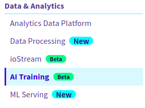
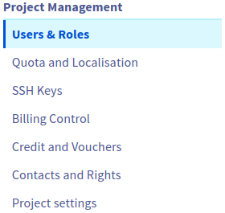
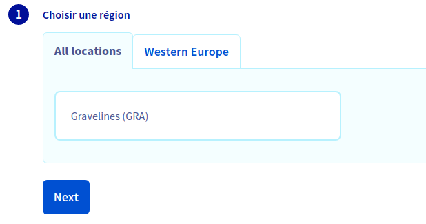
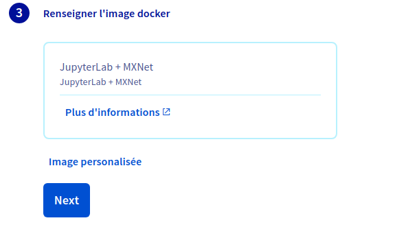
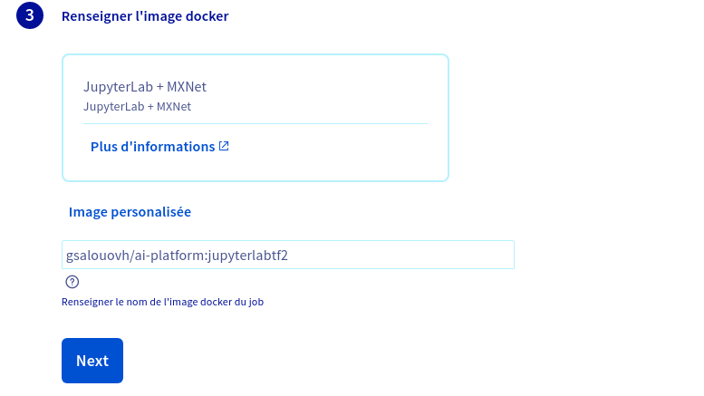

*Last updated 12th August, 2020.*

## Objective

This guide covers the initialization of **AI Training** and the
submission of [**jobs**](../jobs) through the Control Panel.

## Requirements

-   A **public cloud** project
-   A user for AI Training (creation covered in Step 3)
-   Optionnally **data** objects to attach to the **job** at step 8, see
    [create **data** object](../data).

## Instructions

### Step 1 - Go to the AI Training menu

The control panel for **AI Training** is located within the
`Public Cloud` section of the **OVHcloud control panel** and can be
found under `Data & Analytics` &gt; `AI Training`

{.thumbnail}

### Step 2 - Activate AI Training service

Once you read general information and validated this services's contract
terms, you can start submitting your jobs. Upon activating the AI
Training service you grant OVHcloud access to your Object Storage
containers. This access is only used to synchronize your data within
**AI Training** with your containers.

{.thumbnail}

#### Dashboard

Once **AI Training** is activated you land on the service **dashboard**
swith several components.

{.thumbnail}

-   Informations: useful informations for service usage
-   Usage: brief summary of number of jobs according to their state
-   Billing: an overview of your ongoing billing
-   **AI Training** users: list of users that can use this service
-   Jobs: list of active jobs

The list of **AI Training** users should be empty at the moment, let us
add a new user.

### Step 3 - Create AI Training users

To user **AI Training** you need to create users with the correct roles.

User management is available in the `Public Cloud` control panel under
`Project Management` &gt; `Users & Roles`

{.thumbnail}

Create a new [user](../users) and specify the required roles. Two roles
are used within **AI Training**

-   AI Training Operator: Grants access to **AI Training**
-   Objectstore Operator: Grants read/write access to the OVHcloud
    Object Storage, required to use **data** synchronization features.

It is recommanded to assign both roles.

{.thumbnail}

### Step 4 - Start a job submission

From the **job** list in the dashboard you can start the job submission
by clicking the `Submit Job` button.

{.thumbnail}

### Step 5 - Select a Region for your job

Each **job** is executed in an OVHcloud region. Each region has its own
**AI Training** cluster with potentially varying capabilities. For more
information see the [capabilities](../capabilities). Select the desired
region and click `next`.

{.thumbnail}

### Step 6 - Select a user

All jobs submitted from the `Control Panel` are created using
administrator priviledges but are necessarily assigned to an **AI
Training** users. Pick from the **AI Training** users filtered list the
desired user and click `next`.

{.thumbnail}

### Step 7 - Provide a Docker image

A job is basically a Docker container that is run within OVHcloud
infrastructure. You need to provide a Docker image to be executed. There
are several options you can choose from:

#### Preset Images

OVHcloud provides a set of images from which you can choose to ease the
submission of your first **jobs**. Provided images are essentially
JupyterLab environment bundled with some Deep Learning technology such
as Tensorflow or MXNet.

{.thumbnail}

#### Custom Images

Preset images cannot cover all your needs so you can specify your own
image if necessary. You can use any image that is accessible from **AI
Training**.

This includes public images (e.g. Dockerhub), images within the shared
registry or images in your attached private registry. For more
information see [attach a private registry](../attach-private-registry).

For more information about image tags for images within the shared
registry refer to the [\$partner\_full client
documentation](https://docs.console.preprod.training.ai.cloud.ovh.net/pages/tutorial.html#docker-images).

Once yout image is chosen, click `next`.

{.thumbnail}

### Step 8 - Attach data to your job (optional)

You can attach [**data**](../data) objects to your job either as input
for your training workload or as output for your results (e.g. model
weights).

Before attaching a data you need to [create one](../data). A **data**
cannot be attached to a running **job**.

To attach a **data** object just select among the list on the left. Next
to each data within the parenthesis you can check the mount path in the
Docker container for the submitted **job**. If you wish to customize
this mount path you will need to use the **\$partner\_full client**, its
installation procedure is available [here](../install-client).

{.thumbnail}

Once the data is configured click `next`.

### Step 9 - Override the Docker entrypoint (optional)

The Docker image you provided in Step 7 includes an entrypoint for your
container. You can override this entrypoint by specifying your own
command. ONce the entrypoint is setup click `next`.

{.thumbnail}

### Step 10 - Specify amount of resources

**AI Training** leverages \$partner\_full Orkestrator to orchextrate and
schedule workloads using GPU resources. In this step you can select the
amount of GPUs you want to be used during your training workload.

The max amount of GPUs you can select for your **job** is region
dependant. For more information see the [capabilities](../capabilities).

Once the number of GPUs is set you can see a preview of the minute
billing rate for this amount of resources. Click `next`.

{.thumbnail}

### Step 11 - Submit your job

In the final step you get an overview of the **job** you configured
before submission. You also get the equivalent command to use with the
**\$partner\_short client**.

{.thumbnail}

The **AI Training** service is mainly supposed to be use through the
**\$partner\_full client**. The control panel only offers a subset of
the features and is meant to help you get started before using the
client.

Finally click `submit` to submit your **job** to the cluster.

> [!warning]
>
> A job will run indefinitely until completion or manual interruption.

### Step 13 - Consult your job

Once the job is submitted you are redirected to the **job** list page.

{.thumbnail}

From this list you can access your job details either bi clicking on its
`ID` or by selecting `Details` in the additional action on the far
right. The details include several components:

{.thumbnail}

-   **Job Information**: basic information on the job you submitted
-   Container: describe the state of your job and provides you with the
    url to access any service exposed by your job on the port `8080`.
    The url is of the form
    `https://<JOB-ID>.job.console.<REGION>.training.ai.cloud.ovh.net/`.
    If the service is not exposed on the port `8080` it is still
    accessible by specifying the port in the url this way
    `https://<JOB-ID>-<PORT>.job.console.<REGION>.training.ai.cloud.ovh.net/`.
    You can check the list of available port in the
    [capabilities](../capabilities).
-   Resources: a summary of the resources consumed by the **job**
-   Actions: available actions
-   Data: list of **data** objects attach to the job

### Step 14 - Cancel your job

If you are over using your notebook, if your model converged prematurely
or if you just wish to interrupt your job you can do so from the **job**
list.

From the list of **jobs** you can list the available actions at the far
right of the each entry and interrupt the job by clicking `Stop`.
Alternatively from a **job** detail you can also interrupt the job from
the list of actions.

## Going Further

-   You can checkout the documentation about the [**\$partner\_full
    client**](https://docs.console.preprod.training.ai.cloud.ovh.net/)
-   You can checkout the documentation about [how to setup the
    \$partner\_full client](../install-client)

## Feedback

Please send us your questions, feedback and suggestions to improve the
service:

-   On the OVHcloud [AI community
    forum](https://community.ovh.com/c/platform/ai-ml)
