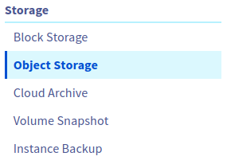
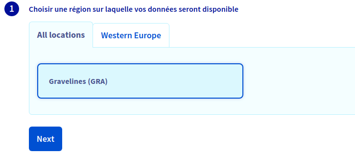
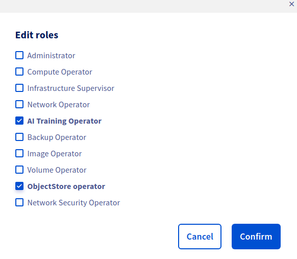

*Last updated 14th August, 2020.*

## Objective

This guide covers the creation of [**data**](../data) objects in **AI
Training** through the control panel and their association with Object
Storage containers.

## Requirements

-   A **Public Cloud** project
-   **AI Training activated** for your account, see [how to submit a job
    Step 2](../submit-job)
-   A user for AI Training [how to submit a job Step 3](../submit-job)

## Instructions

### Step 1 - Create an Object Storage container

If you already have Object Storage containers you want to use you can
skip the following steps and directly start at Step 2.

You can access the Object Storage page in the `Public Cloud` control
panel under `Storage` &gt; `Object Storage`.

{.thumbnail}

From the Object Storage page click `Create an object container`.

Select the location for you data container. To improve synchronization
performances choose the location closest to the **AI Training** cluster
you plan to use. For more information about available regions see the
[capabilities](../capabilities).

{.thumbnail}

Once you set a location you need to select the type of container you
want to use. For private data to use with **AI Training** it is
recommended to use a `Private` container.

{.thumbnail}

Finally choose a name for your container and then click
`Create the container`.

### Step 2 - Go to the **data** objects tab of **AI Training**

Within the **AI Training** control panel there is a dedicated tab for
managing **data** objects: `Data`.

{.thumbnail}

You can init the creation of a new **data** by clicking the
`Attach a container` button.

### Step 3 - Select a Region

In the control panel all **data** objects you create are associated with
an Object Storage container for persistent storage. Select the location
of the **AI Training** cluster in which you plan to use this **data**
object.

{.align-center}'

Once the region is selected click `Next`.

### Step 4 - Select the data container

A drop-down menu lets you choose among all containers available. This
container will be attached to the **data** object allowing
synchronizations.

{.thumbnail}

Before a [**job**](../jobs) you can sync your data from the Object
Storage to your **data** objects to refresh your data and once your job
is completed you can sync your data from the **data** object to the
Object Storage to persist results.

> [!warning]
>
> Object Storage containers and **data** objects are not automatically
> synchronized to avoid data loss in case of misbehaving training
> workload. To ensure the persistence of your results make sure to
> synchronize your containers after the training workload is over.

Once you selected your container click `Next`.

### Step 5 - Select a user

All **data** objects created from the `Control Panel` are created using
administrator priviledges but are necessarily assigned to an **AI
Training** users. Pick from the **AI Training** users filtered list the
desired user and click `Next`.

{.thumbnail}

### Step 6 - Create your **data** object

Set a name for your **data** object, this name should be an all
lowercase alphanumeric string with underscores allowed.

Once the name is selected you can set a flag to directly imnport your
data. This will trigger a synchronization between the Object Storage
container and your **data** object. If the data you are creating is
input data for your training workload you should set this flag.

{.thumbnail}

Before submitting the creation you can see the equivalent command to use
with the **\$partner\_short client** to create the same **data**
object.\

The **AI Training** service is mainly supposed to be use through the
**\$partner\_full client**. The control panel only offers a subset of
the features and is meant to help you get started before using the
client.

Finally click `Send` to submit your **data** creation.

### Step 7 - Consult your **data** objects

One the creation is submitted you are redirected toward the **data**
objects panel of **AI Training**. From this list you can check the
**data** objects created along with their synchronization state.

{.thumbnail}

In particular: 
> * `Last import` gives you the state of the last
synchronization triggered from the Object Storage to the **data** object

> * `Last export` gives you the state of the last synchronization
triggered from the **data** object to the Object Storage

You can trigger a synchronization by accessing the actions on the far
right of the list entry. You only need to select the direction of your
synchronization and you get the equivalent command to use with the
**\$partner\_short client**.

{.thumbnail}

## Going Further

-   You can check the official documentation about [how to submit a
    **job**](../submit-job)

## Feedback

Please send us your questions, feedback and suggestions to improve the
service:

-   On the OVHcloud [AI community
    forum](https://community.ovh.com/c/platform/ai-ml)
